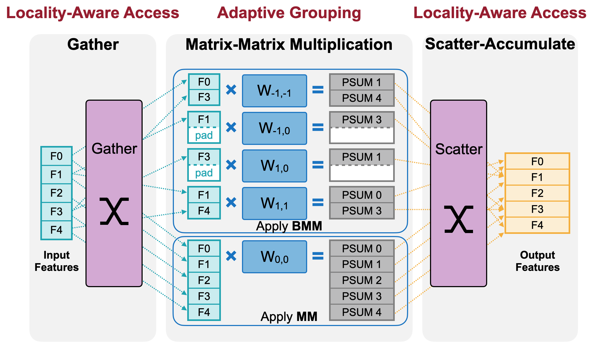

# Enabling Inference Optimizations

Below shows an overview of optimizations for inference speedup implemented in TorchSparse.



To use any optimizations, set `torchsparse.backends.benchmark = True` first.

```{note}
Our optimizations are designed for and work the best under the `fp16` precision. 
Although they can also be run under the `fp32` precision, the speedup effects have not been tested.
```

## Locality-Aware Access
We reduce the **memory footprint** of sparse convolution via **fused and locality-aware memory access**. 
This will be automatically applied if `torchsparse.backends.benchmark = True`.

## Adaptive Grouping
We **trade computation for regularity**, optimizing matrix multiplication in sparse convolution via **adaptive grouping**. 
To enable adaptive grouping, you need to first tune a best grouping strategy using a few samples:
```python
model = ... # your model to be used
dataflow = ... # an iterator with your data samples, usually in the form of torch.utils.data.DataLoader
torchsparse.tune(
    model=model,
    data_loader=dataflow,
    n_samples=10,
    collect_fn=lambda data: data['input'],
)
```
Then the adaptive matmul grouping will be automatically applied in the forward pass. 
Please refer to [`torchsparse.tune`](https://torchsparse.readthedocs.io/en/latest/reference/torchsparse.utils.html#torchsparse.utils.tune.tune) and [this example](https://github.com/mit-han-lab/torchsparse/blob/master/examples/example.py) for more details.